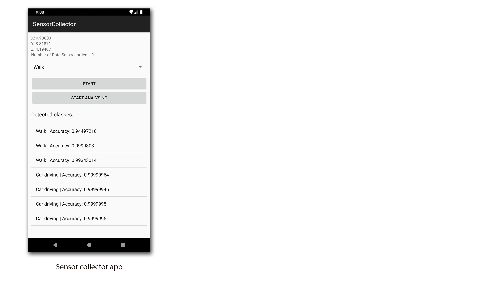
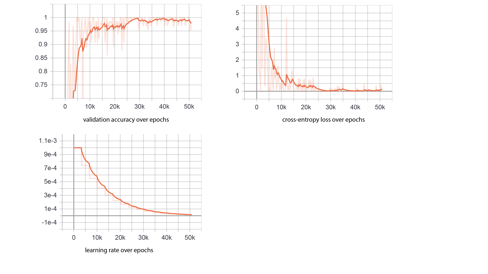

# Description
In this project i have trained a convolutional neural network
to classify the state of a smartphone into the states: walk, 
bike, rail travel, car drive. To create a data set i have
programed a Android app which records the accelerometer and
the gyroscope while doing this activities. Later on i also
integrated the trained model into the app to make live predictions 
on the smartphone. I made this project in spring 2018 in my 
free time besides my computer science studies. 
Here you can see a screenshot from the app:



# Training
To train the neural network i collected from every class
roughly 1000 samples. After 15 epochs i have a accuracy
of 98.44% on previously unseen data. You can see the
process of training in the following graphs:



### Training output

````commandline
Number of classes: 4
Class 0: 1047
Class 1: 1080
Class 2: 1020
Class 3: 1058

Train data: 3365
Val data: 632
Test data: 200

Could not find old network weights

Epoch 0, validation accuracy 0.6516
Epoch 1, validation accuracy 0.7078
Epoch 2, validation accuracy 0.8016
Epoch 3, validation accuracy 0.9359
Epoch 4, validation accuracy 0.8797
Epoch 5, validation accuracy 0.8906
Epoch 6, validation accuracy 0.875
Epoch 7, validation accuracy 0.9203
Epoch 8, validation accuracy 0.9828
Epoch 9, validation accuracy 0.975
Epoch 10, validation accuracy 0.9781
Epoch 11, validation accuracy 0.9781
Epoch 12, validation accuracy 0.9781
Epoch 13, validation accuracy 0.9797
Epoch 14, validation accuracy 0.9797
Final test accuracy 0.984375
````


